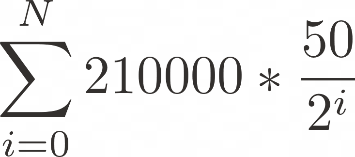

# Plotting Stock-to-flow model in Python

## Prerequisites
- [Python3.6](https://www.python.org/downloads/release/python-360/)
- [pip](https://pip.pypa.io/en/stable/)
- [matplotlib](https://matplotlib.org/)
- [pandas](https://pandas.pydata.org/)
- [numpy](https://numpy.org/)
- [quandl](https://github.com/quandl/quandl-python)
- [quandl.com api key](https://docs.quandl.com/docs#getting-an-api-key)

To install them, run the following commands in terminal:

```bash
sudo apt install python3.6 python3-pip
```

```bash
python3.6 -m pip install matplotlib pandas numpy quandl
```

Paste your API key at line `1` of `sf.py`:

```python
APIKEY = 'YOUR_API_KEY'
```

### Running the script
```bash
python3 sf.py
```

***
### Step-by-step Stock-to-flow calculation

> Increase the scarcity of gold to a certain degree, and the smallest bit of it may become more precious than a diamond, and exchange for a greater quantity of other goods.  – __Adam Smith, An Inquiry into the Nature and Causes of the Wealth of Nations__

Stock-to-flow ratio was initially introduced by Saifedean Ammous in The Bitcoin Standard [[1]](#1--saifedean-ammous--the-bitcoin-standard-the-decentralized-alternative-to-central-banking) and suggested by PlanB as an approximate measure of price of Bitcoin [[2]](#2--planb--modeling-bitcoins-value-with-scarcity). Although the model does not take into consideration demand for Bitcoin, it does project its price according to its scarcity (stock-to-flow ratio), i.e. total supply divided by its increase over a certain period:


Where:

| Symbol                | Description                                            |
|:---------:| ---------------------------- |
| SF                | Stock-to-flow ratio            |
| S           | Stock (supply)                                     |
| F     | Flow (subsidy of new coins)  |

Provided the known supply and increase of Bitcoin, which are exactly predetermined and hard-coded in its source code and vividly described in its whitepaper [[3]](#3--satoshi-nakamoto--bitcoin-a-peer-to-peer-electronic-cash-system), it is possible to approximately predict the price using the stock-to-flow model. Moreover, due to Bitcoin halvings, reward for each mined block and, as a consequence, flow of new Bitcoins, are reduced by 50% approximately every 4 years (210,000 blocks), which begets significant increase in scarcity.

Initially, the total stock for each halving date is calculated. The following formula describes total technical supply at a particular halving [[4]](#4--kevin-schellinger--understanding-bitcoins-21-million-coins):



Initially, the total stock for each halving date is calculated. This can be implemented using the following Python code, part of which is ndsvw's Bitcoin supply calculator [[5]](#5--ndsvw--bitcoin-supply-calculator).

```python
from datetime import datetime

def days_between(d1, d2):
    d1 = datetime.strptime(d1, "%Y-%m-%d")
    d2 = datetime.strptime(d2, "%Y-%m-%d")
    return abs((d2 - d1).days)

def btcSupplyAtBlock(b):
    if b >= 33 * 210000:
        return 20999999.9769
    else:
        reward = 50e8
        supply = 0
        y = 210000
        while b > y - 1:
            supply = supply + y * reward
            reward = int(reward / 2.0)
            b = b - y
        supply = supply + b * reward
        return (supply + reward) / 1e8


genesis = '2009-01-01'
hdates = ['2012-11-28','2016-09-07','2020-05-11','2024-05-01','2028-05-01','2032-05-01']

if __name__ == "__main__":
    for date in hdates:
        block = days_between(genesis, date) * 24 * 6
        print(date + " - " + str(btcSupplyAtBlock(block)))
```

| Date of halving   | Stock, BTC         |
| ----------------- | ------------------:|
| 28 November 2012  | 10,274,450.0       |
| 9 July 2016       | 15,351,625.0       |
| 11 May 2020       | 17,968,212.5       |
| ~ 1 May 2024      | 19,476,606.25      |
| ~ 1 May 2028      | 20,239,503.125     |
| ~ 1 May 2032      | 20,620,351.5625    |

The network difficulty is set the way that new Bitcoin blocks appear in the blockchain around every 10 minutes. Giving the fact that reward for mining Bitcoin blocks is the only source of new coins and it is reduced by 50% approximately every 4 years (210,000 blocks), it is possible to calculate Bitcoin annual flow using the following formula:


Where:

| Symbol                | Description                                            |
|:---------:| ---------------------------- |
| r     | Reward for each mined block  |

By applying the formula above, the following flow values are determined:

| Date of halving   | Reward after, BTC  | Flow, BTC          |
| ----------------- | ------------------:| ------------------:|
| 28 November 2012  | 25                 | 1,314,000          |
| 9 July 2016       | 12.5               | 657,000            |
| 11 May 2020       | 6.25               | 328,500            |
| ~ 1 May 2024      | 3.125              | 164,250            |
| ~ 1 May 2028      | 1.5625             | 82,125             |
| ~ 1 May 2032      | 0.78125            | 41,062.5           |

By applying the Stock-to-flow formula, the following ratios are determined:

| Date of halving   | Stock-to-flow    |
| ----------------- | ----------------:|
| 28 November 2012  | 7.819            |
| 9 July 2016       | 23.366           |
| 11 May 2020       | 54.697           |
| ~ 1 May 2024      | 118.579          |
| ~ 1 May 2028      | 246.447          |
| ~ 1 May 2032      | 502.292          |

As the following plots illustrate, the higher stock-to-flow ratio is, the higher is market value of Bitcoin and hence, its price. Therefore, this strong correlation makes it possible for the model to predict Bitcoin price in future.


Market value and price of single Bitcoin can be calculated using the following formulae [[6]](#6--planb--bitcoin-stock-to-flow-cross-asset-model):


Where:

| Symbol                | Description                                            |
|:---------:| ---------------------------- |
| MV    | Market value                 |
| SF                | Stock-to-flow ratio            |
| P     | Price                        |
| S           | Stock (supply)                                     |

By applying the data and the formulae above, the following numbers are determined:

| Date of halving    | Estimated weighted annual price after |
| ------------------ | ----------------:|
| 28 November 2012   | $160             |         
| 9 July 2016        | $9,759           |
| 11 May 2020        | $276,490         |
| ~ 1 May 2024       | $6,166,877       |
| ~ 1 May 2028       | $120,592,180     |
| ~ 1 May 2032       | $2,219,429,200   |

The aforementioned approach of measuring Bitcoin’s supply is purely based on fundamental constants hard-coded in its algorithm. Therefore, coins, which were lost during early adoption, significantly decrease the real number of Bitcoin’s supply and hence increase its scarcity, stock-to-flow ratio and market value to a greater value than is was theoretically predicted above.

> Lost coins only make everyone else’s coins worth slightly more. Think of it as a donation to everyone. — __Satoshi Nakamoto__

##### [1] &nbsp;&nbsp;&nbsp;&nbsp; Saifedean Ammous — [The Bitcoin Standard: The Decentralized Alternative to Central Banking](https://saifedean.com/book/)
##### [2] &nbsp;&nbsp;&nbsp;&nbsp; PlanB – [Modeling Bitcoin's Value with Scarcity](https://medium.com/@100trillionUSD/modeling-bitcoins-value-with-scarcity-91fa0fc03e25)
##### [3] &nbsp;&nbsp;&nbsp;&nbsp; Satoshi Nakamoto – [Bitcoin: A Peer-to-Peer Electronic Cash System](https://bitcoin.org/bitcoin.pdf)
##### [4] &nbsp;&nbsp;&nbsp;&nbsp; Kevin Schellinger – [Understanding Bitcoin’s 21 Million Coins](https://medium.com/@k_schellinger/understanding-bitcoins-21-million-limit-310297a7d962)
##### [5] &nbsp;&nbsp;&nbsp;&nbsp; ndsvw – [Bitcoin-Supply-Calculator](https://github.com/ndsvw/Bitcoin-Supply-Calculator)
##### [6] &nbsp;&nbsp;&nbsp;&nbsp; PlanB – [Bitcoin Stock-to-Flow Cross Asset Model](https://medium.com/@100trillionUSD/bitcoin-stock-to-flow-cross-asset-model-50d260feed12)
